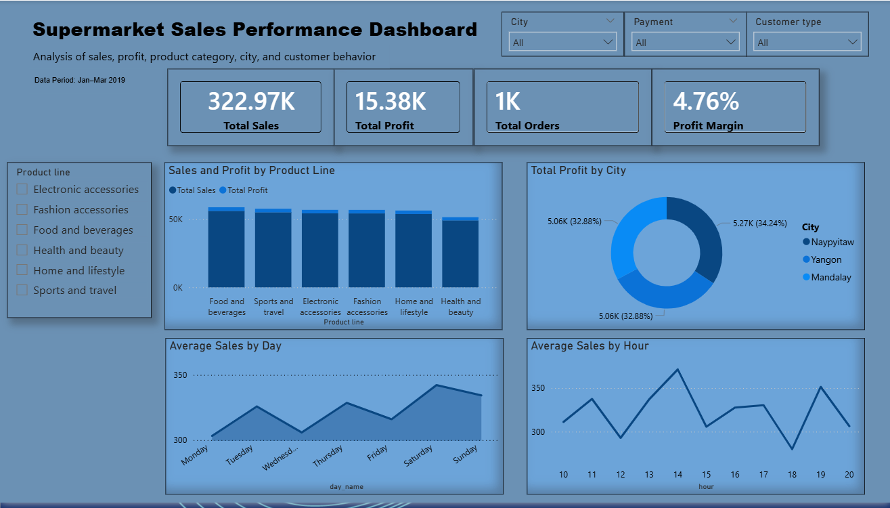

# Supermarket Sales Analytics

## Overview

Project ini menganalisis data penjualan supermarket untuk memahami pola penjualan, perilaku pelanggan, distribusi profit, dan peluang perbaikan bisnis.

Analisis dilakukan menggunakan Python untuk data cleaning dan exploratory data analysis (EDA), kemudian dilanjutkan dengan Power BI untuk membuat dashboard interaktif yang lebih mudah dipahami oleh stakeholder.

## Business Objective

Tujuan project ini adalah menjawab beberapa pertanyaan bisnis utama:

- Berapa total sales, total profit, total orders, dan profit margin?
- Kategori produk mana yang menghasilkan sales dan profit terbesar?
- Kota mana yang memberikan kontribusi profit terbesar?
- Bagaimana pola rata-rata sales berdasarkan hari?
- Bagaimana pola rata-rata sales berdasarkan jam?
- Faktor apa yang paling berkaitan dengan sales berdasarkan analisis korelasi?

## Dataset

Dataset berisi 1.000 transaksi supermarket dengan periode data Januari hingga Maret 2019.

Beberapa kolom utama dalam dataset:

- Invoice ID
- Branch
- City
- Customer type
- Gender
- Product line
- Unit price
- Quantity
- Tax 5%
- Sales
- Date
- Time
- Payment
- cogs
- gross margin percentage
- gross income
- Rating

## Tools Used

- Python
- Pandas
- Matplotlib
- Seaborn
- Google Colab
- Power BI

## Struktur Project

```text
sales-analysis-colab/
├── data/
│   ├── raw/
│   │   └── supermarket-sales/
│   └── processed/
│       └── clean_data.csv
│
├── outputs/
│   ├── figures/
│   │   ├── Sales_by_category.png
│   │   ├── Profit_by_category.png
│   │   ├── Daily_sales_pattern.png
│   │   ├── Hourly_sales_pattern.png
│   │   ├── Profit_by_city.png
│   │   └── Correlation_analysis.png
|   |   └── powerbi_dashboard.png
│   │
│   └── summary/
│       └── business_summary.csv
|       └── key_insights.txt
│
├── notebooks/
│   └── sales_analysis.ipynb
│
├── README.md
├── requirements.txt
└── .gitignore
```

## Project Workflow

1. Data Understanding
   - Mengecek ukuran dataset, nama kolom, tipe data, missing values, duplicate values, dan statistik deskriptif.

2. Data Cleaning
   - Mengubah kolom Date dan Time ke format datetime.
   - Mengubah beberapa kolom menjadi tipe data category.
   - Menstandarkan nilai pada kolom kategorikal.
   - Membuat kolom tambahan berbasis waktu seperti year, month, month_name, day, day_name, dan hour.
   - Menyimpan data bersih ke file `clean_data.csv`.

3. Exploratory Data Analysis
   - Analisis total sales dan profit
   - Sales berdasarkan kategori produk
   - Profit berdasarkan kategori produk
   - Pola penjualan harian
   - Pola penjualan per jam
   - Profit berdasarkan kota
   - Analisis korelasi

4. Business Interpretation
   - Key Insights
   - Business Recommendations
   - Conclusion
     
5. Power BI Dashboard Development
   - Membuat dashboard interaktif menggunakan Power BI untuk menampilkan KPI utama seperti Total Sales, Total Profit, Total Orders, dan Profit Margin.
   - Menambahkan slicer/filter berdasarkan City, Product line, Payment, dan Customer type agar dashboard dapat digunakan secara interaktif.
   - Membuat visual utama seperti sales dan profit berdasarkan Product line, profit berdasarkan City, serta pola rata-rata sales berdasarkan hari dan jam.

6. Portfolio Packaging
   - Merapikan struktur folder project agar siap diunggah ke GitHub.
   - Menambahkan file pendukung seperti README.md, requirements.txt, .gitignore, screenshot dashboard, file Power BI, dan ringkasan key insights.
   - Menyiapkan project agar mudah dipahami oleh recruiter, termasuk dokumentasi workflow, hasil analisis, dashboard preview, dan rekomendasi bisnis.

## Data Limitation

Dataset hanya mencakup transaksi pada periode Januari hingga Maret 2019. Oleh karena itu, analisis tren jangka panjang belum dapat dilakukan. Analisis difokuskan pada pola perilaku penjualan dalam jangka pendek dan pola transaksi berdasarkan kategori, kota, hari, serta jam.

## Power BI Dashboard Preview



## Dashboard Features

- KPI cards for Total Sales, Total Profit, Total Orders, and Profit Margin
- Slicers for City, Product Line, Payment, and Customer Type
- Sales and Profit analysis by Product Line
- Profit analysis by City
- Average Sales pattern by Day
- Average Sales pattern by Hour

## Key Insights

1. Total sales mencapai sekitar 322,97K, dengan total profit sekitar 15,38K dan profit margin sekitar 4,76%.
2. Penjualan dan profit terutama dipengaruhi oleh Quantity dan Unit Price, sementara margin cenderung konstan di seluruh kategori.
3. Distribusi penjualan dan profit antar kategori serta kota relatif merata, menunjukkan bahwa bisnis tidak bergantung pada satu segmen atau wilayah tertentu.
4. Pola penjualan harian cenderung stabil tanpa perbedaan signifikan antar hari.
5. Analisis per jam menunjukkan adanya peningkatan aktivitas pada jam istirahat siang dan malam.
6. Analisis korelasi menunjukkan bahwa Sales dipengaruhi oleh Quantity dan Unit Price, sementara variabel turunan seperti cogs, gross income, dan Tax 5% memiliki korelasi sempurna karena hubungan matematis.

## Business Recommendations

1. Prioritaskan strategi penjualan pada faktor yang paling mendorong Sales, yaitu Quantity dan Unit Price.
2. Optimalkan kesiapan operasional pada jam puncak, terutama saat istirahat siang dan malam.
3. Evaluasi jam dengan performa lebih rendah untuk mencari peluang peningkatan penjualan secara terbatas.
4. Pertahankan distribusi penjualan yang sudah merata antar kategori dan kota agar bisnis tetap stabil.
5. Interpretasikan hasil korelasi secara hati-hati, terutama pada variabel yang saling terhubung secara matematis.

## Files

- `notebooks/sales_analysis.ipynb` — Python notebook for data cleaning and EDA
- `data/processed/clean_data.csv` — cleaned dataset
- `powerbi/sales_dashboard.pbix` — Power BI dashboard file
- `outputs/figures/powerbi_dashboard.png` — dashboard preview image
- `outputs/summary/key_insights.txt` — summary of insights and recommendations
- `outputs/summary/business_summary.csv` — summary of key business metrics such as total sales, total profit, profit margin, and total orders
- `requirements.txt` — Python dependencies
- `.gitignore` — ignored files and folders

## Conclusion

Project ini menunjukkan alur kerja analisis data end-to-end, mulai dari data cleaning dan exploratory data analysis menggunakan Python hingga pengembangan dashboard menggunakan Power BI.

Secara keseluruhan, bisnis menunjukkan performa penjualan dan profit yang relatif stabil di berbagai kategori, kota, dan hari. Faktor utama yang mendorong penjualan adalah Quantity dan Unit Price, sementara pola per jam menunjukkan adanya aktivitas yang lebih tinggi pada jam istirahat siang dan malam.

Temuan ini menunjukkan bahwa peluang optimasi lebih banyak berada pada strategi volume penjualan dan pengelolaan operasional pada jam-jam tertentu.

## Author

Khairu Ikramendra
